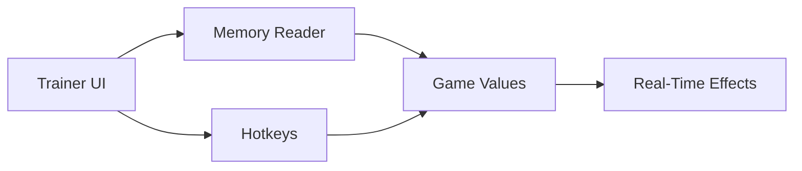

# Throne and Liberty Trainer — Command the Flow, Bend the Numbers

There is a certain hush before the storm in **Throne and Liberty**. Armor creaks. Spells hum. Time itself seems to wait for your next move.
This **Trainer Software** is built for that moment—not to shout over the game, but to *guide* it, gently, decisively, like a hand on the tiller.

Unlike visual overlays or targeting tools, a trainer speaks directly to mechanics: values, timers, limits. It is the quiet art of adjustment, crafted for players who want mastery in PvE, experimentation in builds, and freedom while exploring the world.

---

## 🌒 What Is This Trainer, Really?

A trainer is not about vision—it’s about **control**.

This Throne and Liberty Trainer is a standalone Windows tool that modifies in-game values in real time. No permanent changes. No files overwritten. Just a living set of switches and sliders that you can enable, disable, or fine-tune as the situation demands.

Think of it as a rehearsal room:

* Test builds without grind
* Learn boss patterns without punishment
* Explore mechanics without time pressure

When you return to the stage, you do so wiser.

---

## 🧩 Core Trainer Functions

Each function is modular, restrained, and optional. You choose the tempo.

### ⚔️ Combat & Survival Controls

* God Mode (toggleable)
* Damage multiplier (custom values)
* Defense & resistance scaling
* One-hit break (for testing only)
* No knockback / no stagger

These options are ideal for dungeon learning, solo exploration, or theorycrafting difficult encounters.

---

### 🌀 Cooldowns & Skill Flow

Time is a resource—this trainer gives it back.

* No skill cooldown
* Adjustable cooldown reduction %
* Infinite stamina / mana
* Cast time reduction
* Buff duration extension

Combat becomes a dance without interruption, letting you feel the full rhythm of your class.

> [!NOTE]
> Cooldown features can be applied selectively per skill group to preserve balance during testing.

---

### 🧭 Movement & Exploration

The world is vast. Sometimes you just want to *walk it differently*.

* Movement speed multiplier
* Sprint without stamina drain
* No fall damage
* Free camera (photo & scouting mode)
* Teleport to waypoint (safe zones only)

Perfect for map discovery, screenshots, or quiet wandering under strange skies.

---

## ⚙️ Interface & Ease of Use

The trainer interface is intentionally simple—almost old-fashioned in its honesty.

* Clean windowed menu
* Hotkey toggles for every function
* Real-time value editing
* Preset profiles (PvE / Exploration / Testing)
* Minimal background resource usage

No clutter. No visual noise. Just levers waiting to be pulled.

---

Accessibility notes:

* Large readable fonts
* Keyboard-only navigation
* No color-dependent indicators

> [!WARNING]
> Trainer functions are intended for **offline, solo, or PvE environments**. Using value modification tools in competitive online modes may violate game rules.

---

## ⚡ Installation — Calm and Uneventful

The setup mirrors the philosophy of the tool: nothing dramatic happens.

1. Launch Throne and Liberty
2. Enter the game world
3. Run the trainer as administrator
4. Wait for “Process Attached”
5. Activate desired options via hotkeys or menu

That’s it.
No drivers. No restarts. No residue.

---

## 🔁 How the Trainer Interacts with the Game

Everything flows one way. When you close the trainer, the river returns to its natural course.

---

## ❓ FAQ — Quiet Questions, Clear Answers

**Is this a cheat or a trainer?**
This is a trainer: value-based control, not vision or automation.

**Can I save my settings?**
Yes. Profiles can be saved, loaded, and swapped instantly.

**Does it modify game files?**
No. All changes are temporary and memory-based.

**Is it suitable for learning bosses?**
Very much so. Many users rely on it to practice mechanics without repeated wipes.

**Will updates break it?**
Minor patches are usually handled quickly; major updates may require a short wait.

---

## 🌙 Final Thoughts

A trainer is not about domination—it’s about understanding.

In Throne and Liberty, where systems intertwine like constellations, this software lets you pause the sky, trace the lines, and learn the shapes. You can push, pull, test, and reflect—then step back into the world unchanged, but not unaltered.

Power is louder when it’s earned.
This tool simply gives you time to listen.

---
